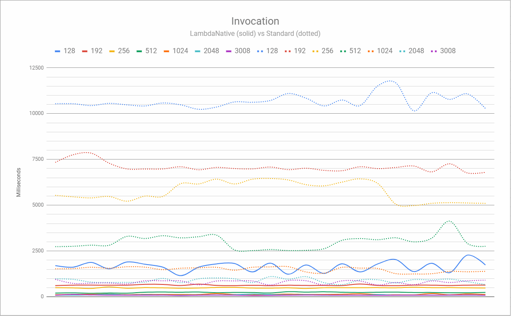

#  LambdaNative
Make .NET AWS Lambda functions start 10x faster using LambdaNative and custom for solved AWS Lambda connection timeout (Based on [lambda-native](https://github.com/zaccharles/lambda-native) by @zaccharles)

Found this solution: Suratchanan Kraidech

[](https://ci.appveyor.com/project/ifew/lambda-native/branch/master)
[](https://www.nuget.org/packages/iFew.LambdaNative/)
  

# Usage

To use LambdaNative in your own project, please see the README in the [example](example) directory. 

# How It Works

At the end of 2018, AWS [announced](https://aws.amazon.com/about-aws/whats-new/2018/11/aws-lambda-now-supports-custom-runtimes-and-layers/) Custom Runtimes and the Runtime API that enables them. In a nutshell, you select Custom Runtime and provide an executable named file `bootstrap` (in your ZIP file) which AWS Lambda will execute instead of its own. You're then responsible for interacting with an HTTP API to get executions, running handler code, and reporting the result or any errors back to the API.  

LambdaNative is a library that handles all the API interaction and error handling for you. All you need to do is tell it which handler to execute by implementing an interface and calling `LambdaNative.Run`.

You can then use [CoreRT](https://github.com/dotnet/corert) to perform ahead of time compilation, producing a native executable that doesn't require any runtime compilation.

Below is a comparison between a standard function and one running under LambdaNative. The function deserialies a request object, writes to DynamoDB, publishes an SNS message, and returns a response object.

For more information and comparisons, please read [this Medium post](https://medium.com/zaccharles/8e53d6f12c9c).



# Development and Testing

## Prerequisites

 * [.NET Core SDK 2.2.402](https://dotnet.microsoft.com/download/dotnet-core/2.2)

## Building

Clone repository
```bash
> git clone https://github.com/ifew/lambda-native.git
```

Restore NuGet packages
```bash
> dotnet restore
```

Build solution
```bash
> dotnet build
```

## Testing

Run unit tests
```bash
> dotnet test
```

# Contributing

If you find any problems or have any suggestions, please raise an issue or send a pull request.

# License

This project is licensed under the MIT License - see the [LICENSE](LICENSE) file for details
